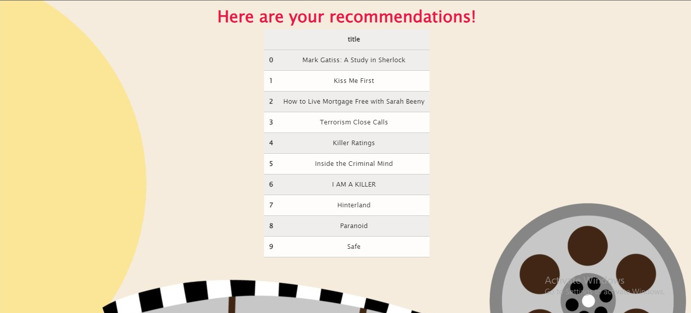

# Flask-Netflix-Recommendation-System
A flask web-app which can be used to get recommendations for a tv-show/movie, the app recommends a list of media according to the input.

# Screenshot 1 : Main Page 
Here the user can enter their movie of choice, for example I have entered Sherlock a British Crime Netflix original show.

# Screenshot 2 : Recommendation Page 
Here the user will get recommendations, for example I recieved A Study in Sherlock(another Crime Netflix original) as my top recommendation 

